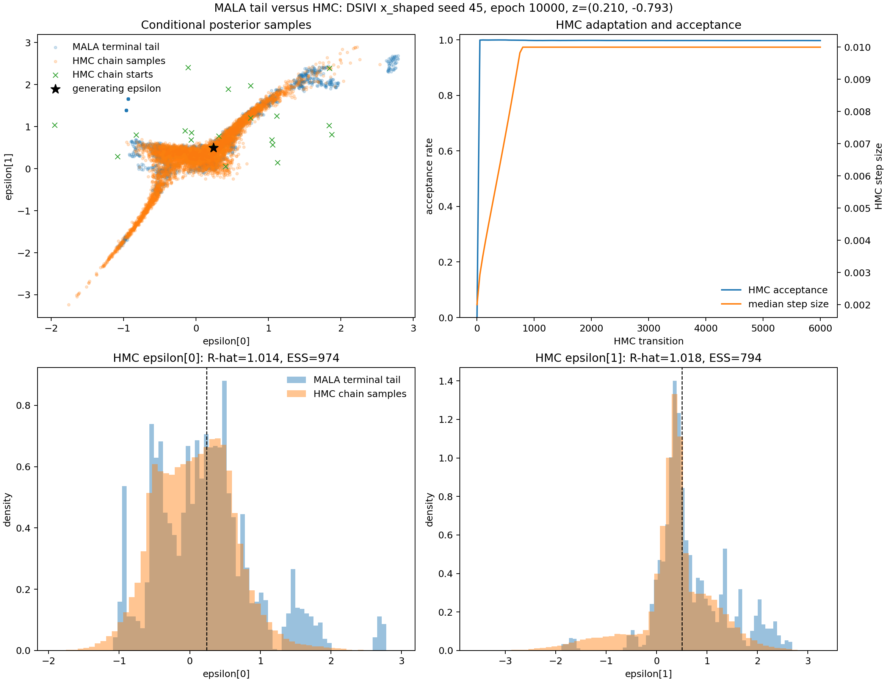

# MALA-tail versus HMC posterior-epsilon comparison

DSIVI `x_shaped`, seed 45, epoch 10000, fixed z. MALA shows only its last 50 retained draws per chain; HMC diagnostics use all 5000 retained draws from every chain.

| Sampler | Acceptance | Split R-hat max | ESS min | Converged |
|---|---:|---:|---:|:---:|
| MALA | 0.96810313 | 4.83195965 | 35.46 | no |
| HMC | 0.99731667 | 1.01774538 | 794.39 | no |

