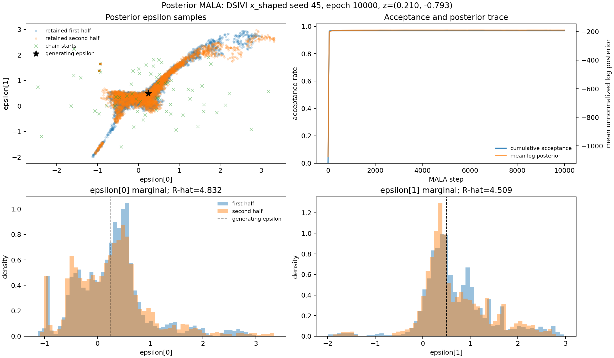

# Posterior-epsilon MALA diagnostic

DSIVI `x_shaped`, seed 45, epoch 10000; epsilon dimension 2.

At 10,000 steps with step size 0.0001, this run **does not pass all configured diagnostics**. Acceptance alone is not used as evidence of convergence.

| Metric | Value |
|---|---:|
| Overall acceptance rate | 0.96810313 |
| Post-burn acceptance rate | 0.96797500 |
| Maximum split R-hat | 4.83195965 |
| Minimum classical ESS | 35.46 |
| Maximum standardized early/late drift | 0.03033749 |
| Invalid proposal fraction | 0.00000000 |

